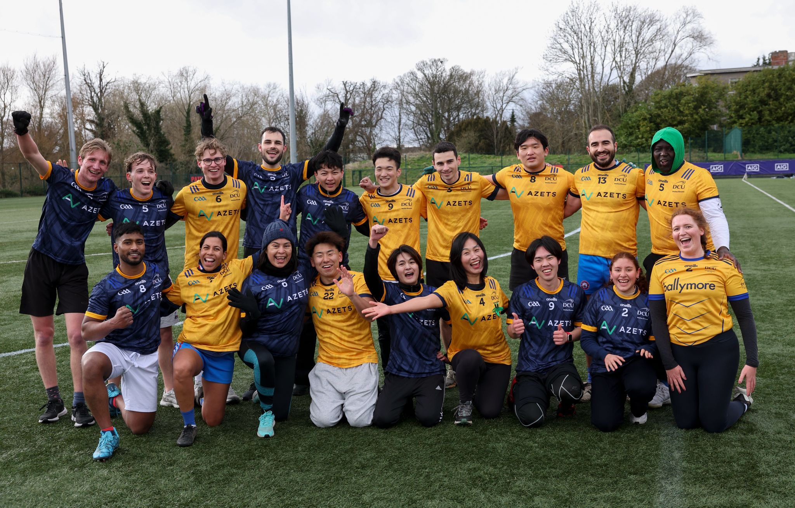

I am a French Business Administration student at Montpellier Business School (MBS), currently expanding my international perspective through an Erasmus semester at Dublin City University (DCU). Ranked 8th out of a cohort of 471 students, I am deeply committed to academic excellence and continuous personal growth.

My professional background spans from customer relationship management in the banking sector (Crédit Agricole) to an upcoming role in real estate, which has helped me develop strong adaptability and client-facing skills. 

Beyond academics and my professional goals, I am driven by a deep curiosity for the world. I am passionate about traveling, discovering new places, and connecting with people from diverse cultural backgrounds. I thrive in dynamic, international environments and constantly seek out new challenges that push me out of my comfort zone. This adventurous spirit is a big part of who I am, especially when it comes to staying active. Whether I am training for a half-marathon, joining the finance society, or fully embracing the local Irish culture by trying out Gaelic sports alongside volleyball and archery during my time in Dublin, I love the energy and personal growth that come from stepping into the unknown.

{fig-align="center" width="70%"}

**Objective:** I am currently seeking a 12-month work-study program (alternance) in Business Development and Client Relations starting in September 2026.